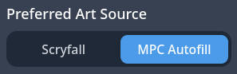
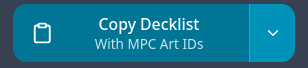
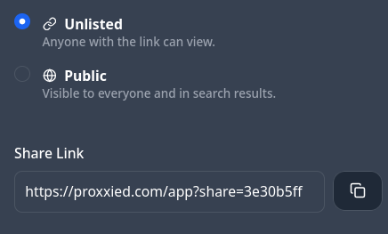

# HOW-TO

1. **Create a decklist**. My personal recommendation is [Moxfield](https://moxfield.com/) with the [tagger addon](https://github.com/natefinch/moxtags/tree/main), another popular option is [Archidekt](https://archidekt.com/).
2. **Go to [Proxxied](https://proxxied.com/)** proxy builder.
3.  **VERY IMPORTANT Select MPC Autofill**
    

      

        on the left side of the page under 'Preferred Art Source'.
      

      
    

4. **Import your cards.** Be aware that if you import via url it will include your maybe and sideboards which takes up a lot of memory while editing.  
  -You can check 'auto import tokens' before importing.  
  -You can export just your mainboard and commander from the deckbuilding sites; copy-paste.  
5. **Select art!** Click on each card and find the art you like the best from the ones available on **MPCautofill**. There are sort options available, and you can set specific tags and proxy artist sources as favorites to make importing future decks much quicker.
If the art you want is not available, custom cards can be created using [CardConjurer](https://cardconjurer.app/), and art upscaled with [Upscayl](https://upscayl.org/). You can also select Scryfall as a source if needed.  
6. **Select a cardback.** Flip one of the cards, select a cardback and override the default. Be careful of mdfc.  
7. **Export MPC art selection.**
    

      
On the right side of the page under 'Export', select 'Copy Decklist - With MPC Art IDs'.

      
    

    **It is important you copy the MPC Art ID and not the basic decklist.**
    

      

        Alternatively make an account on Proxxied and create a share link from the top right of the page.
      

      
    

8. Fill out the below form, be sure to attach your MPCFill Art ID decklist!

